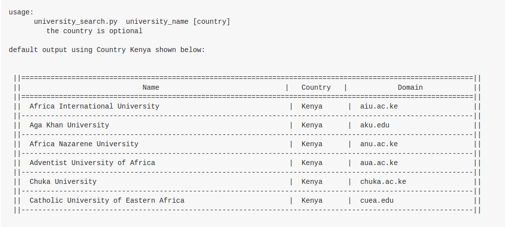

## Day 2 : Outcome 7 - HTTP and Web Services

This assignment  facilitates  a developer to gain knowledge on HTTP request cycle. It also provides a platform for a developer to learn about the use of APIs

### The Solution
The structure of the solution:
```
    lib
      +
      +--+lib.py
      +--+__init__.py
      +
    university_search.py
```

```lib.py``` contains the functions to connect to an API and print the response to the console

```university_search.py```  forms entry point of the program and creates an instance of ```lib.py``` . 
The`lib.get_universties_list`  function  to get data from the internet while the `lib.padded_print` function displays the information on the console


### THE API : http://universities.hipolabs.com
***
The API provides information on universities names and internet domains. The response may be filtered  based on partial university ```name``` and/or  ```country``` . 

The API provides one URL endpoint [```/search```](http://universities.hipolabs.com/search) for accessing the resource . 

 The response is filtered by sending `name` and/or `country` as HTTP GET queries to the endpoint. The API response is a JSON file containing a list of a university data . Homepage located at  [http://universities.hipolabs.com](http://universities.hipolabs.com/).


#### sample query
* [http://universities.hipolabs.com/search?name=middle&country=Turkey](http://universities.hipolabs.com/search?name=middle&country=Turkey)
  : get universities with partial name ```middle```  and located in ```Turkey```
  
* [http://universities.hipolabs.com/search?country=Kenya](http://universities.hipolabs.com/search?country=Kenya)
  : get all universities  and located in ```Kenya```

#### sample response
```
[
    {
        "alpha_two_code": "TR",
        "country": "Turkey",
        "domain": "sabanciuniv.edu.tr",
        "name": "Sabanci University",
        "web_page": "http://www.sabanciuniv.edu.tr/"
    },
    ...
]
```

## Usage
The program requires the ```requests``` package 
  
  	python university_search.py university_name [country] 

The script expects a full/partial name and an optional country to display the information to the console
*Note*: Running the script without any arguments defaults to hard coded parameters: Country = Kenya and an empty University Name 

## sample output
 


