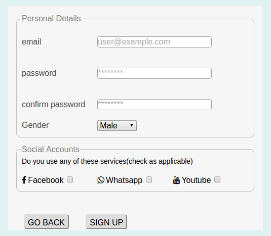

## Day 3: Outcome 8 - Front-End Development
This folder contains a simple registration page created using HTML and CSS. HTML determines the content and CSS describes the styling of the content in the demo webpage

#### Screenshot ####

The demo webpage uses:

* [Normalize.css](https://necolas.github.io/normalize.css/) to render all elements more consistently and in line with modern standards
* [FontAwesome.css](http://fontawesome.io/) privide the scalable social media icons
* [prefix-free.js](https://leaverou.github.io/prefixfree/) add the browser-specific prefix to standard CSS properties, when needed.
* [modernizr.min.js](https://modernizr.com/) detectes the specific HTML, CSS and JavaScript features of the user browser
